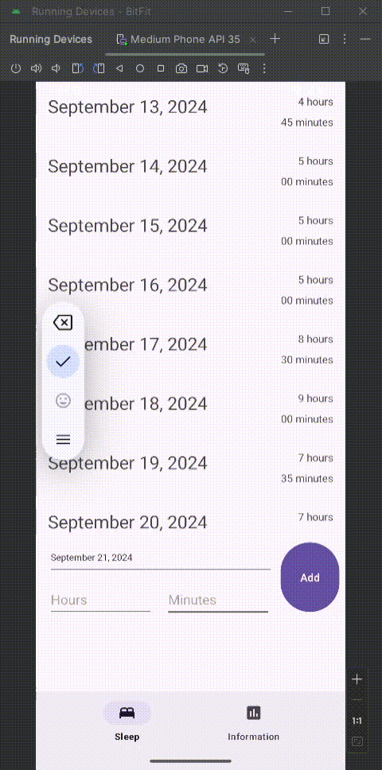

# Android Project 5 - *Sleep Tracker*

Submitted by: **Daniel Olson**

**Sleep Tracker** is a health metrics app that allows users to track their sleep.

Time spent: **4** hours spent in total

## Required Features

The following **required** functionality is completed:

- [X] **At least one health metric is tracked (based on user input)**
  - Chosen metric(s): Sleep
- [X] **There is a "create entry" UI that prompts users to make their daily entry**
- [X] **New entries are saved in a database and then updated in the RecyclerView**
- [X] **On application restart, previously entered entries are preserved (i.e., are *persistent*)**
 
The following **optional** features are implemented:

- [ ] **Create a UI for tracking averages and trends in metrics**
- [ ] **Improve and customize the user interface through styling and coloring**
- [ ] **Implement orientation responsivity**
- [ ] **Add a daily photo feature**

The following **additional** features are implemented:

- [ ] List anything else that you can get done to improve the app functionality!

## Video Walkthrough

Here's a walkthrough of implemented user stories:

## Notes

I had to downgrade my version of Android Studio just so I could do this lab and project for this week.

## License

    Copyright [yyyy] [name of copyright owner]

    Licensed under the Apache License, Version 2.0 (the "License");
    you may not use this file except in compliance with the License.
    You may obtain a copy of the License at

        http://www.apache.org/licenses/LICENSE-2.0

    Unless required by applicable law or agreed to in writing, software
    distributed under the License is distributed on an "AS IS" BASIS,
    WITHOUT WARRANTIES OR CONDITIONS OF ANY KIND, either express or implied.
    See the License for the specific language governing permissions and
    limitations under the License.